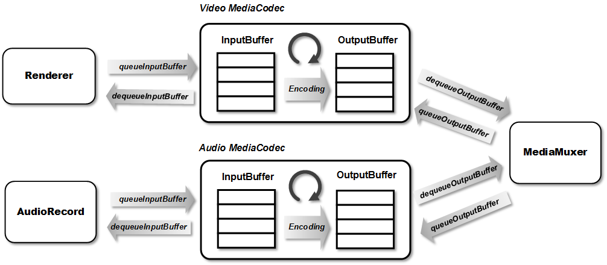
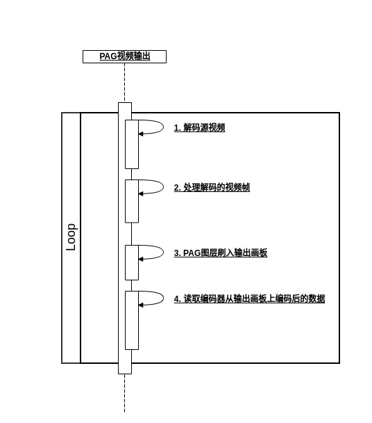
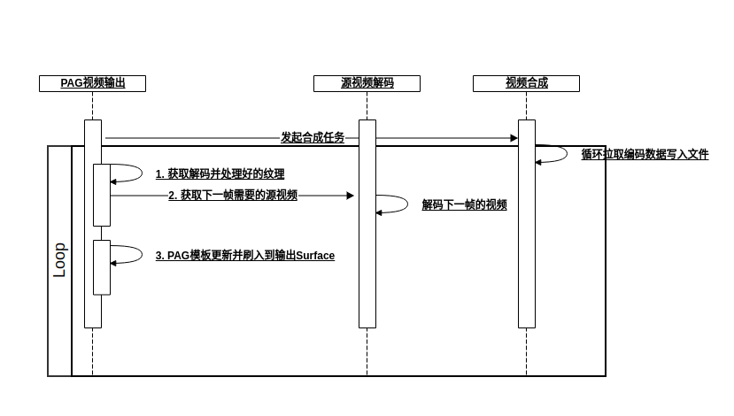
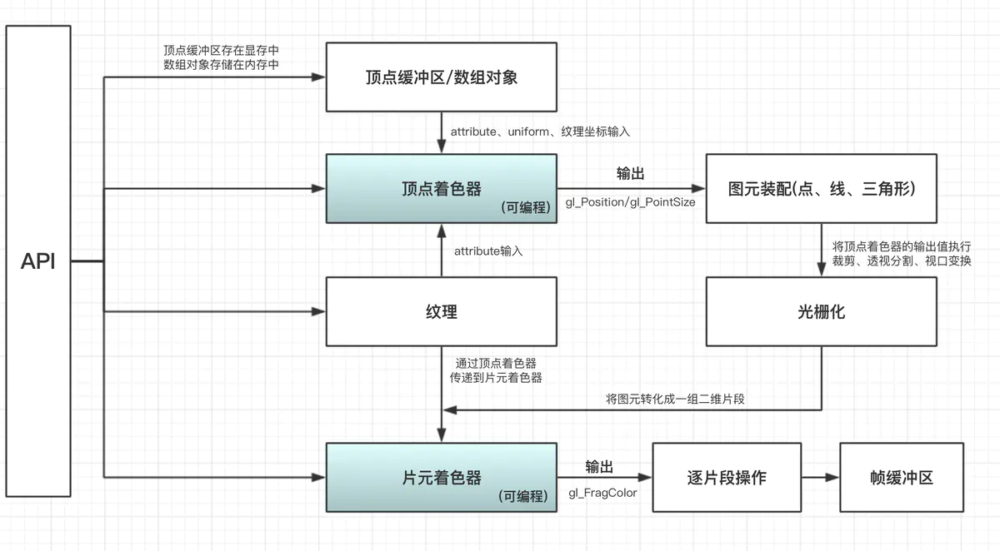

# 一: Android中一个视频的合成过程

这个是直播中用到的一个合成视频的概要图。



## 1. 视频

视频直接理解就是一组图片, 视频的帧率就是一秒内的图片数量。

> 当然跟压缩文件减小体积一样, 视频&音频都会通过算法压缩体积, 达到减小带宽的目的。

上图中的Render可以理解成我们直观看到的一幅图, 通过MediaCodec(编码器)编码成目标格式的数据(字节数组的形式)。

> 一般性能最优的是系统提供的硬件编码器, 当然也可以使用ffmpeg内的编码器。

## 2. 音频

音频相对视频没有那么多的裸数据格式, 一般就是PCM16(16bit范围)。经过编码器编码成目标格式的数据。

直播中音频录制会使用AudioRecord, 比较高效且稳定, 我们项目里都是有现成的编码后的音频, 可以直接用。

## 3. 合成器

视频和音频经过编码之后, 需要把他们再合并到一个文件中, 就用到合成器, 合成器就是一个根据目标输出格式的封装工具,

按照协议把视频跟音频封装到一个文件中。

# 二: PAG的使用

``` java
// 1. 配置PAG
PAGFile pagFile = PAGFile.Load(PAG模板文件);
PAGSurface pagSurface = PAGSurface.FromSurface(输出的Surface);
pagPlayer = new PAGPlayer();
pagPlayer.setSurface(pagSurface);
pagPlayer.setComposition(pagFile);
pagPlayer.setProgress(0);

loop until end {
	// 2. 更新PAG模板图层
	PAGImage image = getFromVideo(timeUs);
	if (image != null) {
	    pagFile.replaceImage(pagVideoIndex, image);
	}
	// 3. 刷入到输出的Surface
	int totalFrames = (int) (pagFile.duration() * pagFile.frameRate() / 1000000);
	float progress = frameIndex % totalFrames * 1.0f / totalFrames;
	pagPlayer.setProgress(progress);
	pagPlayer.flush();
}

// 4. 释放资源
pagPlayer.release();
pagPlayer = null;

```

以上就是PAG的使用方法, 输出的Surface对应的就是视频合成中的Render

PAG模板设置完图层后, 调用flush把合成内容更新到输出Surface

PAG使用setComposition设置合成画板为PagFile, 通过修改pagFile来更改当前的模板状态。

# 三: 我们之前的问题

PAG的使用最重要的部分就是【2. 更新PAG模板图层】, 这里就是我们二次处理视频后替换掉模板内的图层的步骤。

之前的代码, 从上自下调用顺序如下, 直接看到最后。


```java

int totalFrames = (int) (pagFile.duration() * pagFile.frameRate() / 1000000);
for (int i = 0; i < totalFrames; i++) {
	...
    generateSurfaceFrame(i, i * (1000000 / pagFile.frameRate()), replaceVideo);
}
...

private void generateSurfaceFrame(int frameIndex, float timeUs, boolean replaceVideo) {
    if (replaceVideo) {
        PAGImage image = getFromVideo(timeUs);
        if (image != null) {
            pagFile.replaceImage(pagVideoIndex, image);
        }
    }

    int totalFrames = (int) (pagFile.duration() * pagFile.frameRate() / 1000000);
    float progress = frameIndex % totalFrames * 1.0f / totalFrames;
    pagPlayer.setProgress(progress);
    pagPlayer.flush();
}

private PAGImage getFromVideo(float timeUs) {
    frameGrab.getFrameAtTime(timeUs);
    Bitmap bitmap = frameGrab.getBitmap();

    if (bitmap == null) {
        return null;
    }

    return PAGImage.FromBitmap(bitmap);
}


// Decode Frame and wait for frame to be processed
public void getFrameAt(final int frame){
    if(DEBUG) Log.d(TAG, "Get Frame at " + frame);

    // Return if reached End of Stream
    if(codec.isEOS()){
        if(DEBUG) Log.d(TAG, "Reached End-Of-Stream");
        return;
    }

    mGLHandler.post(new Runnable() {
        @Override
        public void run() {
            try {
                codec.getFrameAt(frame); // Has to be in a different thread than framelistener
                if(codec.isEOS()){
                    output.frameProcessed();
                }
            } catch (Exception e) {
                e.printStackTrace();
            }
        }
    });
    output.awaitFrame(frame); // Wait for Frame to be available
}

// Wait for FrameProcessed()
void awaitFrame(int frame){
    if(DEBUG) Log.d(TAG, "Waiting for FrameAvailable");
    synchronized (mWaitFrame) {
        try {
            mWaitFrame.wait();
        } catch (InterruptedException ie) {
            throw new RuntimeException(ie);
        }
    }
}
```

**awaitFrame**方法的实现是一个同步锁, 阻塞线程的执行, 会在解码出一帧视频后唤醒，获取一个Bitmap(图片对象)

这个Bitmap还是通过**glReadPixels**的方法读取的, 这个方法效率并不算高

整个过程都是串行执行的

源视频指定时间解码处理后取一帧图片 -> 图片替换PAG模板文件图层 -> 视频获取编码数据


## 耗时分析



* 解码视频文件 40ms~
* 解码视频后的二次处理 15ms~
* 视频处理后转换成Bitmap的过程 10ms~
* 图层替换后的合成 5ms~
* 编码器编码 10ms~

假设以上每个耗时点平均一帧为以上分布(其他步骤的时间平均分布到这几步中), 一个25帧的8s的视频合成线性执行的耗时

Time = 80ms x 25 x 8 = 16000ms = 16s

## 可以优化的方向

* 优化视频解码的方式, 不再去每帧单独去解码, 从头解码视频, 跟着合成时间轴去解码获取视频帧, 每次单独去取又要更长时间来解码, 不是关键帧需要PB帧来推测出画面
* 结合PAG的API文档, 发现可以使用纹理替代Bitmap, 纹理只需要创建一次即可, 移除转换Bitmap的过程, 节约时间和内存
* 解码视频与合成分开处理, 解码可以相对合成预处理一帧, 在获取到当前帧处理之后, 可以让解码去单独再去取下一帧, 我们继续做后续的合成

> 之前的步骤有一步挺费时间且消耗内存, 就是每次都要把视频的内容从GPU中读取到CPU后转换成Bitmap来替换PAG文件的图层
> 
> 查看PAG相关代码, 发现PAGSurface和PagImage等都有FromTexture的方法
> 
> 这样就可以直接都在GPU处理, CPU取到最后编码好的视频数据即可, 这样大量减少了耗时的切换耗时
> 
> 
> ```java
> // 之前的代码, drawFrame在GPU绘制, readPixels把GPU的结果读取到CPU
> mGLHelper.drawFrame(sTexture, textureID);
> if (isAlpha) {
>    frame = mGLHelper.readPixels(mWidth / 2, mHeight);
> } else {
>    frame = mGLHelper.readPixels(mWidth, mHeight);
> }
> 
> // PAG相关的方法
> /**
> * Create a PAGSurface from specified OpenGL texture, return null if there is no current OpenGL context or the
> * texture is invalid. Note:
> * 1. The target of texture must be GL_TEXTURE_2D.
> * 2. The texture should not bind to any frameBuffer.
> * 3. PAG will use the current (OpenGL) context.
> */
> public static PAGSurface FromTexture(int textureID, int width, int height) {
>    return FromTexture(textureID, width, height, false);
> }
> 
> /**
> * Creates a PAGImage object from the specified OpenGL texture ID, returns null if the texture
> * is invalid or there is no current openGL context. Note:
> * 1. The caller must make sure that the texture outlive the lifetime of the returned PAGImage
> * object.
> * 2. The current openGL context should be the same as the shareContext parameter of
> * {@link PAGSurface#FromSurfaceTexture(SurfaceTexture, EGLContext)} or the context which PAGSurface.FromTexture() uses,
> * so that the returned PAGImage object can be drawn on to that PAGSurface.
> * 3. The caller can use fence sync objects to synchronise texture content (see {@link
> * PAGPlayer#flushAndFenceSync(long[])} and {@link PAGPlayer#waitSync(long)}).
> *
> * @param textureID   the id of the texture.
> * @param textureTarget either GL_TEXTURE_EXTERNAL_OES or GL_TEXTURE_2D.
> * @param width       the width of the texture.
> * @param height      the height of the texture.
> *
> * @see PAGSurface#FromSurfaceTexture(SurfaceTexture, EGLContext)
> * @see PAGSurface#FromTexture(int, int, int)
> * @see PAGSurface#FromTexture(int, int, int, boolean)
> * @see PAGSurface#FromTextureForAsyncThread(int, int, int)
> * @see PAGSurface#FromTextureForAsyncThread(int, int, int, boolean)
> * @see PAGPlayer#flushAndFenceSync(long[])
> * @see PAGPlayer#waitSync(long)
> */
> public static PAGImage FromTexture(int textureID, int textureTarget, int width, int height) {
>    return FromTexture(textureID, textureTarget, width, height, false);
> }
> ```




# 四: 使用OpenGL ES2.0实现视频的二次处理

在线渲染<https://www.shadertoy.com/>

视频存在二次处理的过程, 之前的实现也是基于OpenGL ES处理的, 使用到的方法其实不多, 结合业务的需要进行调用即可

```java
* glViewport // 设置视图的大小和位置, 纹理相当于一张画布, 这里就是指定从哪开始绘制多大的范围
* glUseProgram // OpenGL ES的渲染程序
* glActiveTexture // 激活纹理
* glBindTexture // 与glActiveTexture结合使用, 把纹理绑定到激活的纹理上
* glEnableVertexAttribArray // 使该顶点变量(一般用于坐标)可用
* glVertexAttribPointer // 设置该顶点变量的数据
* glUniformMatrix4fv // 设置该矩阵变量(一般就是变换矩阵)的数据
* glDrawArrays // 按照编写的程序绘制到当前上下文环境的窗口上
```

主要的就是以上这些, 有其他参数方法名稍微不同的方法, 但是作用一样

## 1. GLES的编写

GLSL(Opengl Shading Language)是OpenGL的着色语言。跟我们开发的语言其实一样, 网上一搜都有。

用到的最基本的程序就那么几个, 然后再根据自己的需求调整, 这是我们程序中用到的2个程序。

```
// 顶点着色器
uniform mat4 uMVPMatrix;
uniform mat4 uTexMatrix;
attribute vec4 aPosition;
attribute vec4 aTextureCoord;
attribute vec4 aTextureLeftCoord;
attribute vec4 aTextureRightCoord;
varying vec2 vTextureCoord;
varying vec2 vTextureLeftCoord;
varying vec2 vTextureRightCoord;
void main() {
    gl_Position = uMVPMatrix * aPosition;
    vTextureCoord = (uTexMatrix * aTextureCoord).xy;
    vTextureLeftCoord = (uTexMatrix * aTextureLeftCoord).xy;
    vTextureRightCoord = (uTexMatrix * aTextureRightCoord).xy;
}

// 片元着色器
#extension GL_OES_EGL_image_external : require
precision mediump float;
varying vec2 vTextureCoord;
varying vec2 vTextureLeftCoord;
varying vec2 vTextureRightCoord;
uniform sampler2D sTexture;
uniform samplerExternalOES sOESTexture;
uniform bool is2D;
uniform bool isAlpha;
void main() {
    if (isAlpha) {
        vec4 leftColor = is2D ? texture2D(sTexture, vTextureLeftCoord) 
                : texture2D(sOESTexture, vTextureLeftCoord);
        vec4 rightColor = is2D ? texture2D(sTexture, vTextureRightCoord) 
                : texture2D(sOESTexture, vTextureRightCoord);
        gl_FragColor = vec4(leftColor.r, leftColor.g, leftColor.b, rightColor.r);
    } else {
        gl_FragColor = is2D ? texture2D(sTexture, vTextureCoord) 
                : texture2D(sOESTexture, vTextureCoord);
    }
}
```



这个理论过程不用记, 大概有个理解就行, 我也整不明白, 就知道顶点着色器确定坐标, 片元着色器绘制颜色即可。

顶点着色器里最重要的是gl_Position, 这个是最终的结果坐标范围, 其他几个是计算后传递到片元着色器配合绘制的。

片元着色器里最重要的是gl_FragColor, 确定最终绘制的内容。

texture2D是对纹理取样, 理解就是用纹理的哪一块内容会知道gl_Position圈定的范围。

需要说的是OpenGL没有我们平时开发的那些居中裁切, 它只会根据texture2D取样的结果拉伸铺满gl_Position的坐标范围。

需要这些居中裁切等效果, 就是在顶点着色器里传入矩阵调整texture2D取样的坐标。

## 2. 上下文的创建

OpenGL是单线程执行的, 所有对OpenGL的方法调用都必须在GL线程中执行。

而判断是否可以执行的前提, 就是GLContext, 只有在同一个上下文才能对这个GL线程的资源进行访问修改。

但是在业务中可能会出现多线程的情况, 可以使用shareContext来共享上下文, 但是对性能并没有什么提升,

有时候还会因为上下文切换导致性能下降。

下面就是创建上下文的过程, 这些一般都是一样的, 不需要改动

```java
// 选择屏幕并初始化版本
final EGLDisplay display = EGL14.eglGetDisplay(EGL14.EGL_DEFAULT_DISPLAY);
int[] version = new int[2];
EGL14.eglInitialize(display, version, 0, version, 1)
// 选择配置
EGLConfig[] configs = new EGLConfig[1];
int[] num_config = new int[1];
EGL14.eglChooseConfig(display, attrib_list, 0, configs, 0,
 configs.length, num_config, 0)
// 创建上下文, 如果需要共享, 第三个传共享的上下文对象
final EGLContext context = EGL14.eglCreateContext(display, config, 
    EGL14.EGL_NO_CONTEXT, attrib_list, 0)
```

## 3. 确定输出内容的目标

确定绘制之后展示的位置, 我们项目是输出视频, 目标就是编码器的Surface, 如果需要展示到屏幕, 就创建一个跟屏幕绑定的Surface即可。

比如我在调试绘制时, 是把内容输出到屏幕的, 方便查看当前的效果。

```java
// 使用创建上下文时的display和config创建输出目标
EGLSurface eglSurface = EGL14.eglCreateWindowSurface(mDisplay, mConfig, surface, attrib_list, 0)
// 绑定当前线程到GL上下文, 这一个方法会将GL上下文与当前线程绑定
EGL14.eglMakeCurrent(mDisplay, mSurface, mSurface, mContext);
```

## 4. 程序创建

使用GLSL创建我们绘制的程序

```java
// 创建顶点/片元着色器
int shader = GLES20.glCreateShader(type);
GLES20.glShaderSource(shader, shaderCode);
GLES20.glCompileShader(shader);

// 链接着色器到程序
int program = GLES20.glCreateProgram();
GLES20.glAttachShader(program, vertexShader);
GLES20.glAttachShader(program, fragmentShader);
GLES20.glLinkProgram(program);

// 获取着色器的变量
maPositionLoc = GLES20.glGetAttribLocation(program, "aPosition");
```

## 5. 纹理创建

纹理就相当与一张画布, 根据我们的业务来确定需要创建哪些纹理, 最后再根据需要整合这些画布。

最后输出到第三步确定的输出目标。

如果是YUV的视频格式, 需要用OES纹理来承载, 这样不需要我们去自己做YUV到RGBA的转换。

OES 纹理可以直接接收 YUV 数据或者直接输出 YUV 数据

在我们的项目里, 需要用到的纹理梳理, 可选是根据业务可能有可能没有。

* 解码视频, OES纹理(1)
* 视频二次处理后的纹理, 2D纹理(1)
* \[可选\] PAG模板的输出纹理, 2D纹理(1)
* \[可选\] 贴纸纹理N个, 2D纹理(N)
* \[可选\] 水印纹理, 2D纹理(1) 

视频二次处理这里还要提一个FrameBuffer

业务中很多情况需要对源纹理进行二次处理, 比如我们业务中透明度处理的视频/添加贴纸等

我们需要的是处理完后的内容, 但它需要地方去承载它去处理的过程, FrameBuffer就是这个作用

它跟纹理关联, 在绑定FrameBuffer过程中的绘制, 在解绑之后会更新到关联的纹理上。

```java
// =======> 创建2D纹理
GLES20.glGenTextures(nums, textures, 0);
GLES20.glTexImage2D(GLES20.GL_TEXTURE_2D,
            0, GLES20.GL_RGBA, width, height,
            0, GLES20.GL_RGBA, GLES20.GL_UNSIGNED_BYTE, null);
GLES20.glTexParameteri(GLES20.GL_TEXTURE_2D,
        GLES20.GL_TEXTURE_MIN_FILTER, GLES20.GL_LINEAR);
GLES20.glTexParameteri(GLES20.GL_TEXTURE_2D,
        GLES20.GL_TEXTURE_MAG_FILTER, GLES20.GL_LINEAR);
GLES20.glTexParameteri(GLES20.GL_TEXTURE_2D,
        GLES20.GL_TEXTURE_WRAP_S, GLES20.GL_CLAMP_TO_EDGE);
GLES20.glTexParameteri(GLES20.GL_TEXTURE_2D,
        GLES20.GL_TEXTURE_WRAP_T, GLES20.GL_CLAMP_TO_EDGE);
GLES20.glBindTexture(GLES20.GL_TEXTURE_2D, 0);

// =======> 创建OES纹理
int[] textures = new int[nums];
GLES20.glGenTextures(nums, textures, 0);
GLES20.glBindTexture(GLES11Ext.GL_TEXTURE_EXTERNAL_OES, texture);
GLES20.glTexParameteri(GLES11Ext.GL_TEXTURE_EXTERNAL_OES,
        GLES20.GL_TEXTURE_MIN_FILTER, GLES20.GL_LINEAR);
GLES20.glTexParameteri(GLES11Ext.GL_TEXTURE_EXTERNAL_OES,
        GLES20.GL_TEXTURE_MAG_FILTER, GLES20.GL_LINEAR);
GLES20.glTexParameteri(GLES11Ext.GL_TEXTURE_EXTERNAL_OES,
        GLES20.GL_TEXTURE_WRAP_S, GLES20.GL_CLAMP_TO_EDGE);
GLES20.glTexParameteri(GLES11Ext.GL_TEXTURE_EXTERNAL_OES,
        GLES20.GL_TEXTURE_WRAP_T, GLES20.GL_CLAMP_TO_EDGE);
GLES20.glBindTexture(GLES11Ext.GL_TEXTURE_EXTERNAL_OES, 0);

// FBO绘制过程
GLES20.glBindFramebuffer(GLES20.GL_FRAMEBUFFER, fboId);

// 绘制内容

// 解绑, fboId关联的纹理更新成绘制内容
GLES20.glBindFramebuffer(GLES20.GL_FRAMEBUFFER, GLES20.GL_NONE);
```

## 6. 绘制

绘制过程就是最开始介绍的几个方法来组合使用即可。根据业务需要来, 理解成一张画布

OpenGL ES就是画笔, 其他的顶点配置, 纹理绑定就是画图的构图过程, 最后调用glDraw方法把构图绘制到画布。

可以不止一次的调用glDraw, 可以随时通过glViewport/更新坐标位置 来继续绘制。就跟画画可以一层层绘制一样。

```java
// 设置画布大小
GLES20.glViewport(0, 0, mTargetWidth, mTargetHeight);
GLES20.glUseProgram(mProgram);
// 清理画布
GLES20.glClear(GLES20.GL_DEPTH_BUFFER_BIT | GLES20.GL_COLOR_BUFFER_BIT);
GLES20.glClearColor(0.0f, 0.0f, 0.0f, 0.0f);

// 激活纹理0绑定我们给的纹理
GLES20.glActiveTexture(GLES20.GL_TEXTURE0);
GLES20.glBindTexture(GLES20.GL_TEXTURE_2D, texture);

// 设置矩阵, 单位矩阵相当于保持跟它相乘的变量值
GLES20.glUniformMatrix4fv(muMVPMatrixLoc, 1, false, IDENTITY_MATRIX, 0);
// 设置坐标点
GLES20.glEnableVertexAttribArray(maPositionLoc);
mVertexBuffer.position(0);
GLES20.glVertexAttribPointer(maPositionLoc, 3,
        GLES20.GL_FLOAT, false, 3 * 4, mVertexBuffer);
// 绘制
GLES20.glDrawElements(GLES20.GL_TRIANGLES, DRAW_ORDER.length, GLES20.GL_UNSIGNED_SHORT, mDrawListBuffer);

// 当然根据业务需要可以继续绘制, 比如加个水印/贴纸等
// 设置贴纸的显示范围
GLES20.glViewport(viewportX, viewportY, textureWidth, textureHeight);
// 其他的配置
// 绘制
GLES20.glDrawElements(GLES20.GL_TRIANGLES, DRAW_ORDER.length,
                GLES20.GL_UNSIGNED_SHORT, mDrawListBuffer);
```

## 7. 结束一次绘制

绘制完成后, 输出视频的话, 需要给一个时间戳, 视频的时间戳就是我们在这里设置的

```java
// 它的时间戳是纳秒
EGLExt.eglPresentationTimeANDROID(mDisplay, mSurface, ptsUs * 1000);
```

当前内容还是在Display当中, 我们要把内容输出到Surface才会更新GLContext绑定的目标。

```java
EGL14.eglSwapBuffers(mDisplay, mSurface);
```

这样就输出到了编码器的Surface, 编码器是个消费者模式, 有数据就会开始编码, 我们再去从它的输出队列获取输出的编码视频。

# 结语

目前我用业务开发主流程基本都是这样, 再来就是项目的积累, 碰到新的情况去搜索下解决方案, Get到新的知识点进行补充。

相信大家也能很快掌握OpenGL ES的开发。
