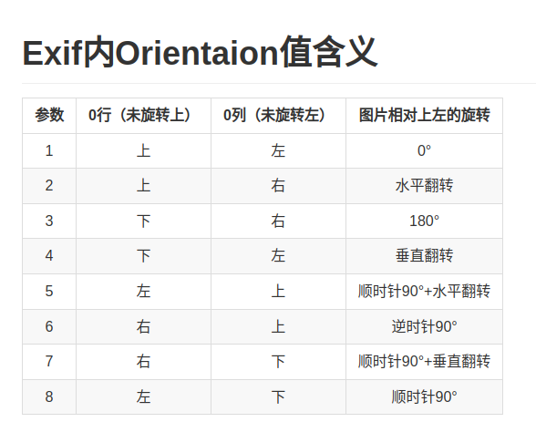

# 一. 场景

有一张10000x10000的图片, 需要取其中的人像头部区域, 并缩放到512x512的大小

首先需要识别到头像, 借助识别SDK识别, 传入整体图【图1】, 识别出头像区域得到头像图【图2】

简单的一个计算图片的内存占用, 假如图片是ARGB_8888的, 那这张图占用的内存是 10000 x 10000 x 4 / 1024 / 1024 = 381.5MB

以下是ChatGPT的回答

* Question

	> Bitmap在不同的Android系统版本的内存限制有什么区别

* Answer

	> 在不同的 Android 系统版本中，Bitmap 内存的限制是不同的，主要有以下几种区别：

	> Dalvik VM：在 Android 4.4 及以下版本中，Dalvik 虚拟机使用的是堆内存，而堆内存的大小是由 Dalvik Heap Size 参数控制的。在默认情况下，Dalvik Heap Size 的大小通常是与设备的 RAM 大小相关的，但是开发者可以在应用程序的 manifest 文件中设置 android:largeHeap="true" 属性来增加 Dalvik Heap Size 的大小，从而允许应用程序使用更多的堆内存。

	> ART：在 Android 5.0 及以上版本中，ART 虚拟机引入了新的内存分配方式，即使用了可分配的非堆内存空间来存储 Bitmap 对象，这种内存空间被称为“native memory”（本地内存）。与 Dalvik VM 不同的是，ART 中 Bitmap 对象的内存限制是与设备的 RAM 大小无关的，而是由系统分配的本地内存空间大小决定的。在 Android 5.0 及以上版本中，每个应用程序能够使用的本地内存空间大小通常为 1/4 到 1/2 的可用 RAM 大小，但是系统也会根据当前内存使用情况进行调整。

	> Android Go：在 Android Go 版本中，为了适应低端设备的内存限制，Google 对 Android 系统进行了一系列的优化，其中之一就是对 Bitmap 对象的内存限制进行了调整。在 Android Go 版本中，每个应用程序能够使用的最大 Bitmap 内存大小通常为 16 MB，这是相对于普通 Android 系统来说更小的内存限制。

	> 因此，不同版本的 Android 系统中 Bitmap 对象的内存限制存在较大的差异，开发者需要针对不同的系统版本进行优化和适配。如果 Bitmap 对象占用过多的内存，可能会导致 OOM 错误，因此在开发过程中应该尽量避免使用过大的 Bitmap 对象，同时及时释放不需要的 Bitmap 对象所占用的内存空间。

---

简单来说, 如果要原图加载【**一张**】原图, 不考虑其他的内存占用, 就需要至少 1G左右的内存, 注意只是【**一张**】


# 二. 实现方案对比

假设原图的头像区域识别未1000 x 1000的大小

内存 = 1000 x 1000 x 4 / 1024 / 1024 = 3MB


## 粗暴做法

直接读入原图【图1】, 校正Exif的旋转与镜像获得【图2】, 识别【图2】, 得到头像区域, 裁切头像区域【图3】


> 内存计算
> 
> 【图1】380MB + 【图2】380MB + 【图3】3MB = 763MB
> 

缺点: 开发SDK能识别这么大的图, 且识别还是会有内存使用, 耗时相对的增长

## 优化版本1

缩放到1000x1000读取缩放图【图1】, 校正Exif的旋转与镜像获得【图2】, 识别【图2】, 得到头像区域, 读入原图【图3】, 校正Exif的旋转与镜像获得【图4】, 裁切头像区域【图4】

> 内存计算
> 
> 【图1】3MB + 【图2】3MB + 【图3】380MB + 【图4】380MB + 【图5】3MB = 766MB
> 

我去, 优化完咋内存还更大了呢, 主要是大部分识别SDK还是不能使用太大的图识别, 项目中一般使用的该方案

## 优化版本2

缩放到1000x1000读取缩放图【图1】, 校正Exif的旋转与镜像获得【图2】, 识别【图2】, 得到头像区域, 校正Exif的旋转与镜像【映射】到原图的区域, 解码换算原图的头像区域图片【图3】, 校正Exif的旋转与镜像获得【图4】

> 内存计算
> 
> 【图1】3MB + 【图2】3MB + 【图3】3MB + 【图4】3MB = 12MB
> 
 
哎嗨, 这个好!

# 三、Android如何实现

对比了上面的3个方案, **优化版本2**明显更好, 接下来开始Code

其他步骤懂得都懂～

但是为啥要映射呢, 因为原图可能带Exif的旋转与镜像, Android中大图局部解码的是不会考虑这些的(我觉得大部分实现都不会去考虑)

那在Android中如何实现呢?

其实就是如何从校正过的头像区域, 换算到原图的区域, 如果自己去计算会比较麻烦, 利用Matrix【ˈmeɪ.trɪks】进行换算



提供了1~8对应的图片供参考, origin文件夹下对应同名就是去除meta信息的原图

## Show Me Code

```java

val matrix = Matrix()
val rotate = orientation != ExifInterface.ORIENTATION_NORMAL 
		&& orientation != ExifInterface.ORIENTATION_UNDEFINED
if (rotate) {
    // Rotate the image back to origin.
    // 缩放图为【图2】
    when (orientation) {
        ExifInterface.ORIENTATION_FLIP_HORIZONTAL -> {
            matrix.postScale(-1f, 1f)
            matrix.postTranslate(缩放图宽, 0f)
        }
        ExifInterface.ORIENTATION_ROTATE_180 -> {
            matrix.postRotate(180f)
            matrix.postTranslate(缩放图宽, 缩放图高)
        }
        ExifInterface.ORIENTATION_FLIP_VERTICAL -> {
            matrix.postScale(1f, -1f)
            matrix.postTranslate(0f, 缩放图高)
        }
        ExifInterface.ORIENTATION_TRANSPOSE -> {
            matrix.postRotate(90f)
            matrix.postTranslate(缩放图高, 0f)
            matrix.postScale(-1f, 1f)
            matrix.postTranslate(缩放图高, 0f)
        }
        ExifInterface.ORIENTATION_ROTATE_90 -> {
            matrix.postRotate(-90f)
            matrix.postTranslate(0f, 缩放图宽)
        }
        ExifInterface.ORIENTATION_TRANSVERSE -> {
            matrix.postRotate(90f)
            matrix.postTranslate(缩放图高, 0f)
            matrix.postScale(1f, -1f)
            matrix.postTranslate(0f, 缩放图宽)
        }
        ExifInterface.ORIENTATION_ROTATE_270 -> {
            matrix.postRotate(90f)
            matrix.postTranslate(缩放图高, 0f)
        }
    }
}
val scale = 原图大小. / 识别的缩放大小
matrix.postScale(scale, scale)
// 头像区域就更新为转换后在原图的区域
matrix.mapRect(头像区域)

val decoder = BitmapRegionDecoder.newInstance(path, true)
// 为了避免出现原图内头像区域同样非常大, 比如有8000x8000, 不需要这么大的图时, 设置下最大目标尺寸
// 在解码时进行缩放即可
val opts = BitmapFactory.Options().apply {
    // 校正的头像区域是目标大小2倍以上时, 进行缩放, 目标大小 ~ 2x目标大小, 保持原图大小
    var inSampleSize = 1
    if (原图内头像区域尺寸 >= 目标大小 * 2) {
        while (原图内头像区域尺寸 / inSampleSize >= 目标大小 * 2) {
            inSampleSize *= 2
        }
    }
    this.inSampleSize = inSampleSize
}
opts.inPreferredConfig = Bitmap.Config.RGB_565
decoder.decodeRegion(头像区域, opts)
// 记得回收哟
decoder.recycle()
```


